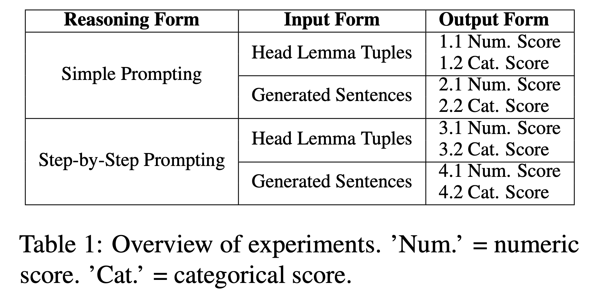
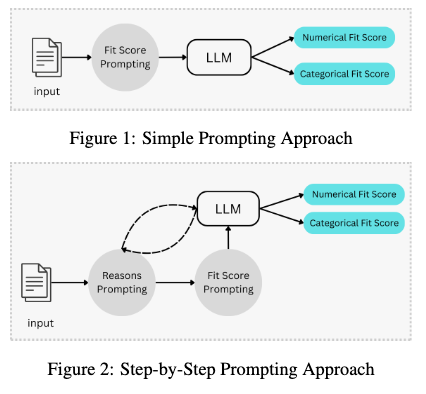

# Uncovering Autoregressive LLM Knowledge of Thematic-Fit in Event Representation 

by
Safeyah Khaled Alshemali,
Daniel Bauer,
Yuval Marton

> This repository consists of our study's source code. In it, we investigate whether pre-trained autoregressive LLMs acquire the internal linguistic knowledge to evaluate thematic fit,  along three axes: (1) Reasoning Form: multi-step logical reasoning (chain-of-thought prompting) vs. simple prompting. (2) Input Form: providing context (generated sentences) vs. raw tuples <predicate, argument,  role>. (3) Output Form: categorical score vs. numeric score. We evaluate closed and open state-of-the-art LLMs on several psycholinguistic datasets (Ferretti Sets, Pado, and McRae). As a result we conduct 8 experiments as shown in the table below. 

  

## Citation
If you use or refer to this work, please cite our paper as follow:

Paper Link: [URL of the Paper]

BibTex:
```
@article{LLM-ThematicFit-24,
      title={Uncovering Autoregressive LLM Knowledge of Thematic-Fit in Event Representation},
      author={Safeyah Khaled Alshemali, Daniel Bauer, Yuval Marton}
      year={2024},
      eprint={??},
      archivePrefix={arXiv},
      primaryClass={??}
}
```

## Implementation
> Implementing this code needs configuring the software dependencies and hardware units. These settings will be explained below and followed by how to get the code.

#### Software Dependencies:
Tested OS: Deep Learning on Linux, VM M112, Debian 11\
Language: Python 3.10\
Python Libraries: json, tenacity, openai (model API endpoint)\
CUDA: 12.1\

#### Hardware Setting
**Platform:** Google Cloud Platform (GCP)\
**Models: **GPT4Turbo (via openai API), Codellama2-Instruct-13B (via huggingfaces)\
**Hardware Configuration:**\
1. GPT Model: any small size of CPU unit is sufficient \
2. Llama Model: to host, run the models' server, and query the model, you need at least two of NVIDIA L4 GPUs.\

The vLLM (https://github.com/vllm-project/vllm) has been used to acquire less GPUS while running the codellama2 model and accelerate its performance.
#### Getting the code

> The experiments has been design via Python languages with some basic libraries like pandas.
> Prompting the model was done through their API endpoint. The vLLM ref(??) has been used to aqcquire less GPUS while running the codellama2 model and accelerate its perforance.
> All source code used to generate the results and figures in the paper are in the `code` folder.
The calculations and figure generation are all run inside
[Jupyter notebooks](http://jupyter.org/).
The data used in this study is provided in `data`. Results generated by the code are saved in `results`. 

## Getting the code

You can download a copy of all the files in this repository by cloning the
[git](https://github.com/SafeyahShemali/LLM-Thematic-Fit-24) repository:

    git clone https://github.com/SafeyahShemali/LLM-Thematic-Fit-24

[check] or [download a zip archive](https://github.com/SafeyahShemali/LLM-Thematic-Fit-24/archive/master.zip).

[check] A copy of the repository is also archived at *insert DOI here*

## Dependencies

1- You'll need a working Python environment (3.10) to run the code.
2- The recommended way to set up your environment is through the [Anaconda Python distribution (https://www.anaconda.com/download/) which
provides the `conda` package manager. --> [check] conda env only for codellama
Anaconda can be installed in your user directory and does not interfere with the system Python installation.
3- CUDA version 12.1

## Reproducing the results

Another way of exploring the code results is to execute the Jupyter notebooks
individually.
To do this, you must first start the notebook server by going into the
repository top level and running:

    jupyter notebook

This will start the server and open your default web browser to the Jupyter
interface. In the page, go into the `code/notebooks` folder and select the
notebook that you wish to view/run.

The notebook is divided into cells (some have text while other have code).
Each cell can be executed using `Shift + Enter`.
Executing text cells does nothing and executing code cells runs the code
and produces it's output.
To execute the whole notebook, run all cells in order.

## License

> All source code is made available under a BSD 3-clause license. You can freely
use and modify the code, without warranty, so long as you provide attribution
to the authors. See `LICENSE.md` for the full license text.


