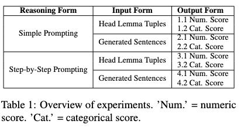

# Uncovering Autoregressive LLM Knowledge of Thematic-Fit in Event Representation

by
Safeyah Khaled Alshemali,
Daniel Bauer,
Yuval Marton

> This repository consists of our study's source code. In it, we investigate whether pre-trained autoregressive LLMs acquire the internal linguistic knowledge to evaluate thematic fit,  along three axes: (1) Reasoning Form: multi-step logical reasoning (chain-of-thought prompting) vs. simple prompting. (2) Input Form: providing context (generated sentences) vs. raw tuples <predicate, argument,  role>. (3) Output Form: categorical score vs. numeric score. We evaluate closed and open state-of-the-art LLMs on several psycholinguistic datasets (Ferretti Sets, Pado, and McRae). As a result we conduct 8 experiments as shown in the table below. 

  

## License

> All source code is made available under a BSD 3-clause license. You can freely
use and modify the code, without warranty, so long as you provide attribution
to the authors.

[Check] See `LICENSE.md` for the full license text.

> The authors reserve the rights to the article content, which is currently submitted for publication in the COLING 2025.

## Citation

[Check] Create BibTex .bib file.

## [Check] Abstract

> The thematic fit estimation task measures the compatibility between a predicate (typically a verb), an argument (typically a noun phrase), and a specific semantic role assigned to the argument. Previous state-of-the-art work has focused on modeling thematic fit through distributional or neural models of event representation, trained in a supervised fashion with indirect labels. In this work, we assess whether pre-trained autoregressive LLMs possess consistent, expressible knowledge about thematic fit. We evaluate both closed and open state-of-the-art LLMs on several psycholinguistic datasets,  along three axes: (1) Reasoning Form:  multi-step logical reasoning (chain-of-thought prompting) vs. simple prompting. (2) Input Form:  providing context (generated sentences) vs. raw tuples <predicate, argument,  role>. (3) Output Form: categorical vs. numeric. Our results show that chain-of-thought reasoning is more effective on datasets with self-explanatory semantic role labels, especially Location.
Generated sentences helped only in few settings, and lowered results in many others. Predefined categorical (compared to numeric) output raised GPT’s results across the board with few exceptions, but lowered Llama’s. We saw that semantically incoherent generated sentences, which the models lack the ability to consistently filter out, hurt reasoning and overall performance too. Our GPT-powered methods set new state-of-the-art on all tested datasets. The source code is available at: https://github.com/SafeyahShemali/LLM-Thematic-Fit-24.

## Software implementation

> The experiments has been design via Python languages with some basic libraries like pandas.
> Prompting the model was done through their API endpoint. The vLLM ref(??) has been used to aqcquire less GPUS while running the codellama2 model and accelerate its perforance.
> All source code used to generate the results and figures in the paper are in the `code` folder.
The calculations and figure generation are all run inside
[Jupyter notebooks](http://jupyter.org/).
The data used in this study is provided in `data`. Results generated by the code are saved in `results`. 

## Getting the code

You can download a copy of all the files in this repository by cloning the
[git](https://github.com/SafeyahShemali/LLM-Thematic-Fit-24) repository:

    git clone https://github.com/SafeyahShemali/LLM-Thematic-Fit-24

[check] or [download a zip archive](https://github.com/SafeyahShemali/LLM-Thematic-Fit-24/archive/master.zip).

[check] A copy of the repository is also archived at *insert DOI here*

## Dependencies

1- You'll need a working Python environment (3.10) to run the code.
2- The recommended way to set up your environment is through the [Anaconda Python distribution (https://www.anaconda.com/download/) which
provides the `conda` package manager. --> [check] conda env only for codellama
Anaconda can be installed in your user directory and does not interfere with the system Python installation.
3- CUDA version 12.1

## Reproducing the results

Another way of exploring the code results is to execute the Jupyter notebooks
individually.
To do this, you must first start the notebook server by going into the
repository top level and running:

    jupyter notebook

This will start the server and open your default web browser to the Jupyter
interface. In the page, go into the `code/notebooks` folder and select the
notebook that you wish to view/run.

The notebook is divided into cells (some have text while other have code).
Each cell can be executed using `Shift + Enter`.
Executing text cells does nothing and executing code cells runs the code
and produces it's output.
To execute the whole notebook, run all cells in order.

